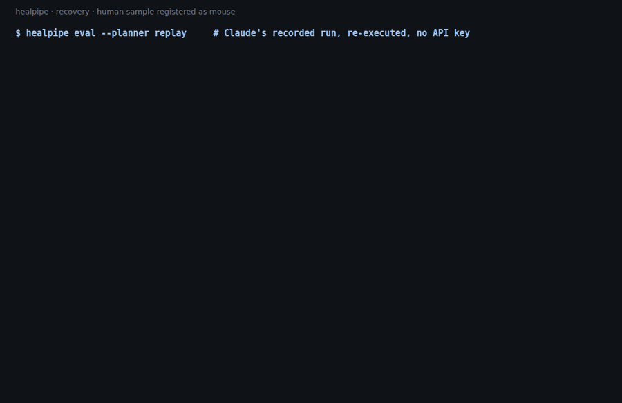

# valny-showcase

> Independent samples on public data. They contain no employer code, data or internal details. Employer work is confidential.

**Browse it without cloning:** [https://martin-valny.github.io/valny-showcase/](https://martin-valny.github.io/valny-showcase/). It includes the knitted tutorial and an example pipeboard report, readable in the browser.

Three small, self-contained projects built on public single-cell and spatial data. Two are in Python and use 10x PBMC3k. The third is an R tutorial on a published mouse ovary spatial sample. Each has its own README and runs its checks offline in CI.

| Project | What it shows | Start here |
|---|---|---|
| [**healpipe**](healpipe/) | **An on-call agent pattern.** A runner executes jobs. A sentinel polls failed jobs, investigates with tools specific to each job type, then makes a gated, dry-runnable config write and relaunches, or escalates. It has an LLM planner (Claude) and a rules baseline. | [README](healpipe/README.md) · [walkthrough](healpipe/docs/WALKTHROUGH.md) |
| [**pipeboard**](pipeboard/) | **A small internal tool.** A form generated from a YAML schema, background jobs as subprocesses, live log streaming with cancel, and a self-contained HTML report. No agent. | [README](pipeboard/README.md) |
| [**ovary-spatial-tutorial**](ovary-spatial-tutorial/) | **An educational Seurat walkthrough** of one published mouse ovary Curio Seeker 3×3 sample (Mantri *et al.*, PNAS 2024; GEO GSE240271): QC → clustering → marker annotation → spatial maps → co-localization → Wilcoxon DE, with "Check your understanding" questions. R Markdown. | [README](ovary-spatial-tutorial/README.md) · [notebook](ovary-spatial-tutorial/ovary_analysis.Rmd) · [knitted HTML](ovary-spatial-tutorial/docs/ovary_analysis.html) |

## Background: how these relate to my work

- **healpipe.** I built an on-call agent that watches failed production pipeline jobs, investigates them with an allow-listed tool loop, and either files a gated fix or escalates. This demo is that pattern on public data (runner + sentinel, per-job tools, dry-run, escalation as a success state), not the production system.
- **pipeboard.** I shipped a browser UI so people could configure and run a batch-correction pipeline (schema-driven form, background jobs, logs, reports) without the CLI. This demo is that product shape on PBMC3k: YAML → form → job → log → HTML report, not that internal tool.
- **ovary-spatial-tutorial.** This one is not an analog of a product I built. It is teaching material: how I walk through a published spatial dataset (QC → annotation → spatial structure → DE). It shows analysis and communication, not what I ran in production.

| healpipe: Claude investigating failed jobs | pipeboard: report UMAP |
|---|---|
|  |  |

## Try it: a 10-minute reviewer tour

You need Python 3.10+. The tutorial also needs R. The Python projects download the public dataset themselves on first use. No API key is needed anywhere.

```bash
git clone https://github.com/martin-valny/valny-showcase && cd valny-showcase
```

**healpipe: agent pattern**
```bash
cd healpipe
python3 -m venv .venv && source .venv/bin/activate && pip install -e ".[dev]"
pytest -q                                                    # 45 passed (offline)
healpipe eval                                                # rules planner: 7/7 correct
healpipe eval --planner replay                               # Claude's recorded run, re-executed: 7/7 correct
healpipe run --scenario species_mislabel --planner replay    # one investigation, step by step
healpipe run --scenario shallow_sequencing --planner replay  # a required escalation
healpipe run --scenario species_mislabel --dry-run           # shadow mode: proposes, writes nothing
deactivate && cd ..
```

**pipeboard: internal tool UI**
```bash
cd pipeboard
python3 -m venv .venv && source .venv/bin/activate && pip install -e ".[dev]"
pytest -q                                                    # offline
pipeboard                                                    # open http://127.0.0.1:8080, Ctrl+C to stop
deactivate && cd ..
```
In the browser, run the default parameters and watch the log. Then open the report, and try `min_genes = 5000` to see a readable failed job.

**ovary-spatial-tutorial: Seurat walkthrough**

Reading [the knitted tutorial online](https://martin-valny.github.io/valny-showcase/ovary-tutorial.html) is enough ([source HTML](ovary-spatial-tutorial/docs/ovary_analysis.html)). To re-run it, follow [its README](ovary-spatial-tutorial/README.md#how-to-run). The notebook installs its own R packages.

CI (`.github/workflows/ci.yml`) runs on every push:
- **healpipe** and **pipeboard**: the Python test suites, on synthetic fixtures, with no API keys.
- **healpipe-replay**: downloads the public data and re-executes the recorded Claude run. It fails if the recording no longer matches the code.
- **ovary-spatial-tutorial**: repo hygiene checks, and a check that every R chunk parses.

## Data and credit

- **PBMC3k:** 10x Genomics, via the example dataset in CZI's cellxgene repository.
- **Mouse ovary:** Mantri M, Zhang HH, Spanos E, Ren YA, De Vlaminck I., *Proc Natl Acad Sci USA* 121(5):e2317418121 (2024). The tutorial is not affiliated with the paper's authors or their institutions beyond citing their work.

No data files are committed. healpipe and pipeboard download PBMC3k on first use; the tutorial fetches its GEO sample with `scripts/fetch_data.py`.
