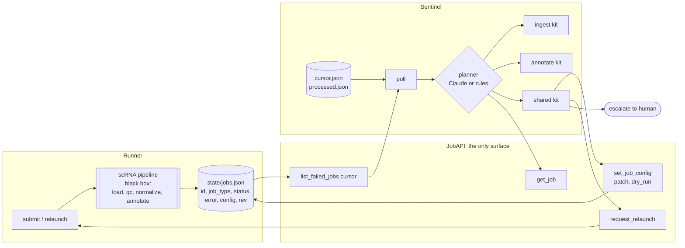

# healpipe

> Independent sample on public data illustrating an agent pattern. Not derived from any employer system; employer work is confidential.

**Background.** I built an on-call agent that watches failed production pipeline jobs, investigates them with an allow-listed tool loop, and either files a gated fix or escalates. This demo is that pattern on public data (runner + sentinel, per-job tools, dry-run, escalation as a success state), not the production system.

A sentinel agent that watches a batch runner. When a single-cell RNA-seq job
fails, the sentinel investigates it with tools specific to that job's type.
Then it either makes a **gated, dry-runnable config write** and asks the runner
to relaunch, or it **escalates to a human**.

```
runner: job fails  ->  sentinel polls  ->  investigate (job-type toolkit)  ->  set_job_config  ->  runner relaunches  ->  pass
                                                                           \->  escalate (no safe fix)
```

The data is public (10x PBMC3k). Every failure is injected on purpose and is reproducible.


*Claude's recorded decisions re-executed through the real tools, with no API key needed (`healpipe eval --planner replay`). The first job is recovered with a config patch and a relaunch. The second is escalated, because the only "fix" would be loosening QC. Each step shows Claude's own stated hypothesis.*

## Architecture



* **Runner** (`runner.py`) executes jobs and writes job records. It knows
  nothing about agents. Relaunch resumes the pipeline from the earliest step
  the pending patch affects.
* **JobAPI** (`api.py`) is the runner's narrow interface. All write validation
  lives in one function, `validate_patch`, and dry-run and apply both go
  through it.
* **Sentinel** (`sentinel.py`) polls with a simple revision cursor, skips job
  ids it has already finished (`processed.json`), and runs one investigation
  per failed job. It never imports the pipeline, and a test enforces that.

## Job types × tools

| tool | ingest | annotate | kind |
|---|:-:|:-:|---|
| `inspect_job` | ✓ | ✓ | read |
| `lookup_similar_traces` | ✓ | ✓ | read (this deployment's past traces) |
| `inspect_matrix` | ✓ | — | read |
| `inspect_gene_names` | — | ✓ | read |
| `inspect_qc_distribution` | — | ✓ | read |
| `set_job_config` | ✓ | ✓ | **write** (gated, `dry_run`) |
| `request_relaunch` | ✓ | ✓ | action (budget: 3) |
| `notify` | ✓ | ✓ | action |
| `escalate` | ✓ | ✓ | terminal |
| **writable keys** | `input_scale`, `orientation` | `species` | QC thresholds: nobody |

An annotate investigation is never offered ingest tools, and it can't call or
write through them. The same holds in reverse. Tests cover both directions.

| scenario | job type | fault | expected |
|---|---|---|---|
| `clean` | ingest | none | never reaches the sentinel |
| `prenormalized_input` | ingest | already normalized + log1p | fix `input_scale=log1p` |
| `transposed_matrix` | ingest | saved genes x cells | fix `orientation=genes_x_cells` |
| `transposed_prenormalized` | ingest | both of the above (stacked) | fix both, relaunch once |
| `negative_values` | ingest | corrupted matrix | **escalate** |
| `species_mislabel` | annotate | human sample registered as mouse | fix `species=human` |
| `shallow_sequencing` | annotate | library ~25x too shallow | **escalate** (lowering QC is not allowed) |

## How to run

```bash
python3 -m venv .venv && source .venv/bin/activate
pip install -e ".[dev]"
pytest -q                                   # offline: synthetic data, rules planner, mocked Claude API

# the first run/eval downloads public PBMC3k into data/ (or: python scripts/fetch_data.py)
healpipe eval                               # submit every scenario, one sentinel poll, scorecard
healpipe run --scenario species_mislabel    # one job: runner -> sentinel -> trace
healpipe run --scenario species_mislabel --dry-run   # shadow mode: would_apply, nothing written
healpipe jobs                               # what the runner's job store looks like
healpipe poll                               # run the sentinel once over existing state

healpipe eval --planner replay              # re-run the recorded Claude decisions, no key needed

# live Claude (needs an Anthropic API key): re-records docs/claude_recordings
export ANTHROPIC_API_KEY=...
healpipe eval --planner claude --record docs/claude_recordings
```

Expected results: `pytest` shows 45 passed. `eval` with the rules or replay planner shows **7/7 correct**, and a second sentinel poll investigates 0 jobs. `run` prints the investigation trace. `--dry-run` ends in `PROPOSED`, and `healpipe jobs` still shows the job as failed with `attempts=0`.

Scorecard with the rules planner on PBMC3k ([docs/eval_rules.md](docs/eval_rules.md)):

| job | scenario | type | expected | outcome | correct | writes | tool calls | label agreement |
|---|---|---|---|---|---|---|---|---|
| job-0001 | clean | ingest | clean | clean | yes | - | 0 | 79% |
| job-0002 | prenormalized_input | ingest | fixed | fixed | yes | input_scale=log1p | 5 | 79% |
| job-0003 | transposed_matrix | ingest | fixed | fixed | yes | orientation=genes_x_cells | 5 | 79% |
| job-0004 | transposed_prenormalized | ingest | fixed | fixed | yes | orientation=genes_x_cells, input_scale=log1p | 7 | 79% |
| job-0005 | species_mislabel | annotate | fixed | fixed | yes | species=human | 5 | 79% |
| job-0006 | shallow_sequencing | annotate | escalated | escalated | yes | - | 3 | - |
| job-0007 | negative_values | ingest | escalated | escalated | yes | - | 3 | - |

**Live Claude run** (`claude-opus-5-5`, effort `medium`; full scorecard in [docs/eval_claude.md](docs/eval_claude.md)): **7/7 correct**, with the same fixes and the same two escalations as the rules baseline.

| scenario | expected | rules | Claude | Claude tool calls |
|---|---|---|---|---|
| prenormalized_input | fixed | fixed (`input_scale=log1p`) | fixed (`input_scale=log1p`) | 5 |
| transposed_matrix | fixed | fixed (`orientation=genes_x_cells`) | fixed (`orientation=genes_x_cells`) | 5 |
| transposed_prenormalized | fixed | fixed (2 writes, 1 relaunch) | fixed (2 writes, 1 relaunch) | 6 |
| species_mislabel | fixed | fixed (`species=human`) | fixed (`species=human`) | 6 |
| shallow_sequencing | escalated | escalated | escalated | 4 |
| negative_values | escalated | escalated | escalated | 3 |

Claude's own reasoning is in the traces. In [shallow_sequencing](docs/claude_traces/shallow_sequencing.claude.trace.md), Claude first rules out a species mismatch, then checks depth (median 73 genes/cell vs. the fixed floor of 200), and escalates with those numbers instead of looking for a threshold to loosen. [species_mislabel](docs/claude_traces/species_mislabel.claude.trace.md) shows a recovery. No API key is needed to re-run it: `healpipe eval --planner replay` re-executes these exact decisions, and CI does so on every push.

After the scorecard, the eval runs a second poll, which investigates 0 jobs.
"Label agreement" compares the annotation with the dataset's published labels,
which the sentinel never sees. A recovered job produces the same biology as the
clean one, not just a passing check.

A step-by-step read of one ingest recovery, one annotate recovery and one
required escalation is in [docs/WALKTHROUGH.md](docs/WALKTHROUGH.md).

## Design decisions

**The sentinel sees jobs, not the DAG.** It gets job records and input
artifacts through `JobAPI`. It can't reach into pipeline state, and it can't
run a step itself. The runner owns execution.

**The LLM plans, the tools act.** Claude chooses which evidence to gather and
which patch to try. Every tool is plain, testable Python.

**Guardrails live in code, not in the prompt.**
- Each job type owns a disjoint set of config keys.
- QC thresholds are owned by nobody. "Make QC pass by lowering the bar" is the
  classic bad automated fix, so it isn't in the action space.
- A relaunch needs a pending patch, so there are no blind retries. It resumes
  from the earliest step the patch affects, and it's capped at 3 per job.
- Every tool call carries a required `rationale`, which becomes the hypothesis
  line in the trace.

**Dry-run is shadow mode.** `set_job_config(..., dry_run=True)` runs exactly
the same validation and returns `would_apply`, with no store write and no
relaunch. With `--dry-run`, the sentinel runs on real failures and records
what it *would* do. Its outcome is `proposed`, and the job stays unprocessed.

**Dedup is by job id.** A job reaches `processed.json` only after a terminal
outcome (fixed or escalated). A relaunch bumps the job's revision past the
cursor, and dedup keeps the sentinel from re-investigating it.

**Escalation is a success state.** Two scenarios are correct *only* if the
sentinel escalates. The eval also fails any run that applied a write and then
escalated anyway.

**A rules baseline, on purpose.** `RulePlanner` encodes the same playbook
deterministically, so CI runs offline and the LLM has a baseline to beat.

## Claude planner

- `claude-opus-5-5` with adaptive thinking and an explicit `effort` (`--effort`, default `medium`).
- Manual tool-use loop, so the harness decides when to stop.
- `strict: true` schemas. The `set_job_config` key enum is narrowed per job type.
- Server-side refusal fallbacks are enabled. Message history is append-only.
- The unit tests use a dummy key and a scripted client. Run `healpipe eval --planner claude` for a live scorecard.

### Reviewing without an API key: record once, replay anywhere

`--record DIR` saves each Claude investigation as one JSON file per scenario. A file holds Claude's text, every tool call with its arguments and rationale, and the result Claude saw back. `--planner replay` feeds those recorded calls back through the **real** runner, JobAPI, per-job-type toolkits and guardrails, and grades the scorecard exactly as for a live run. It is a re-execution, not a transcript printout.

If a live result disagrees with what was recorded (a call that succeeded now fails, or a relaunch ends in a different status), the replay stops at that call. It's graded as a **stale recording**, so a recording can't quietly pass after the code changes. Thinking blocks are not stored.

The recordings from the live run above are in [`docs/claude_recordings/`](docs/claude_recordings/). To re-record after changing prompts or tools, run `healpipe eval --planner claude --record docs/claude_recordings`.

## Data

10x Genomics PBMC3k, taken from the example dataset in CZI's cellxgene
repository. `scripts/fetch_data.py` rebuilds the exact integer UMI counts from
the normalized `.raw` matrix and asserts that per-cell totals match the
published values.

## Disclaimer

**This is an independent sample built on public data to illustrate an agent
pattern.** It is not derived from any employer system and contains no employer code,
data or internal details. Employer work is confidential.
