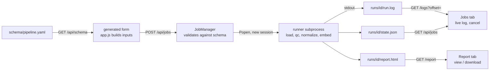
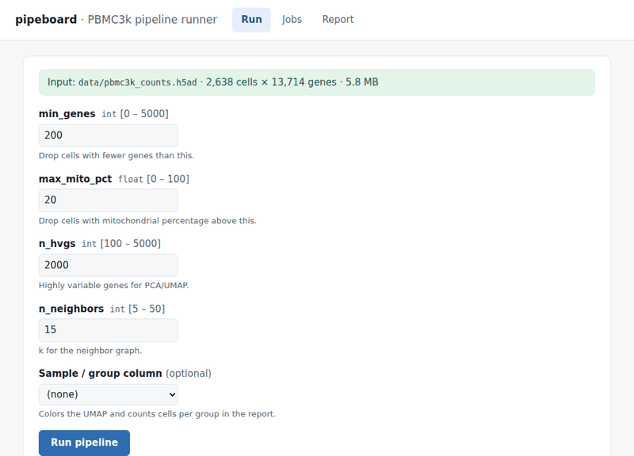
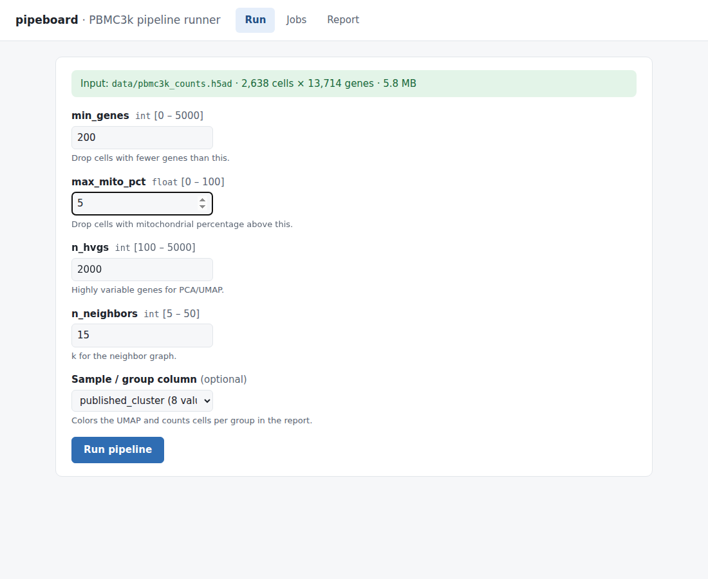
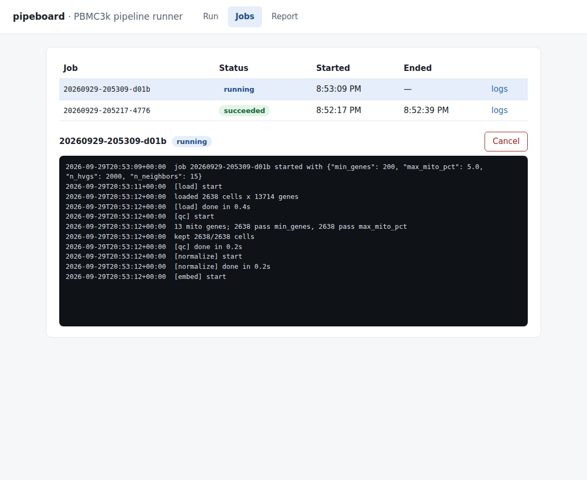
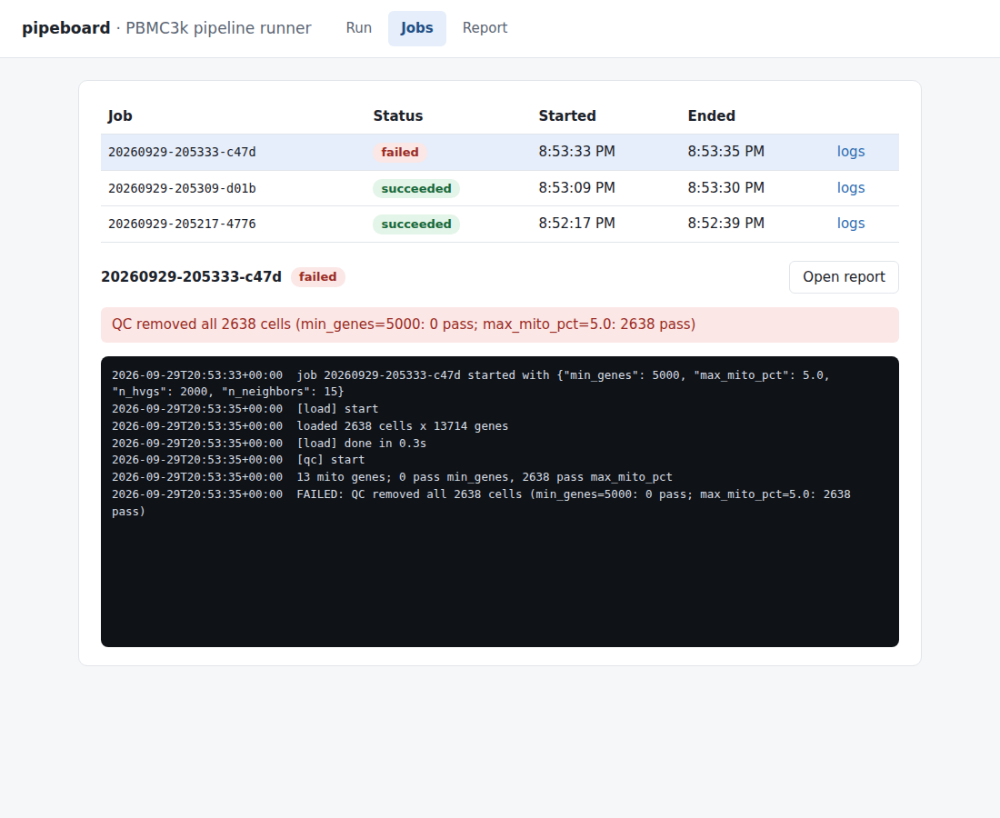
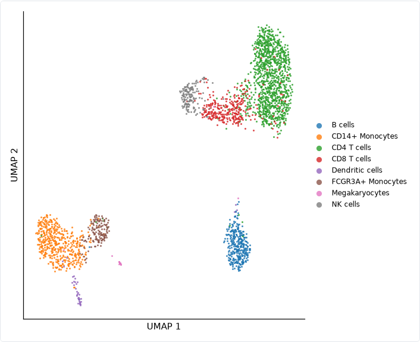

# pipeboard

> Independent sample on public data illustrating a small internal tool (UI + background jobs). Not derived from any employer system; employer work is confidential.

pipeboard is a local web tool for running a small single-cell RNA-seq pipeline on public 10x PBMC3k data. It has a form generated from a YAML schema, background jobs with live logs and cancel, and a self-contained HTML report.



* **The schema drives the form.** `app.js` contains no parameter names. Add a parameter to `schema/pipeline.yaml`, reload, and it appears, with type, bounds and help text. The server validates the same schema on submit, so the browser can't bypass it.
* **Every job is a subprocess** in its own session (`start_new_session=True`). Closing the browser or restarting the server doesn't kill it, and cancel terminates the whole process group.
* **State is plain files.** Each job has `runs/<id>/state.json`, `run.log` and `report.html`. The job list is a scan of `runs/*/state.json`. If a runner dies without writing a terminal state, its job is reconciled to `failed` when read.
* **The report is one static file.** Parameters, a QC table and a UMAP are embedded as a PNG data URI. It opens straight from disk. Failed jobs get a report too, showing the error and "No embedding".

## Run it

```bash
python -m venv .venv && source .venv/bin/activate
pip install -e ".[dev]"
pipeboard                         # http://127.0.0.1:8080; first start downloads public PBMC3k into data/
pytest -q                         # offline: tiny synthetic fixture, no download
```

On first start, `pipeboard` downloads the public dataset into `data/` automatically (one time, a few seconds). To do it by hand, run `python scripts/fetch_data.py`; to skip it, use `pipeboard --no-fetch`. If the file is missing, the Run tab says how to get it and disables submit.

**Try a failure:** set `min_genes` to 5000. QC removes every cell, and the job fails with
`QC removed all 2638 cells (min_genes=5000: 0 pass; max_mito_pct=20.0: 2638 pass)`.

## Screenshots

A local run on PBMC3k: fill the generated form, submit, watch the log stream, then open the report.



Stills from the same kind of run:

| Run: form generated from YAML | Jobs: live log + cancel |
|---|---|
|  |  |
| **Failed run: readable reason** | **Report: UMAP by published cluster** |
|  |  |

## Pipeline

`src/pipeboard/pipeline.py` is intentionally tiny:

1. **load**: read the h5ad and check it is a non-negative cells × genes matrix.
2. **qc**: keep cells with `n_genes >= min_genes` and mito % `<= max_mito_pct` (mito = `MT-` genes). If zero cells remain, the job fails with a clear message.
3. **normalize**: total-count normalization + log1p.
4. **embed**: HVGs (`n_hvgs`), PCA, a neighbor graph (`n_neighbors`), then UMAP.

## API

| Method | Path | Role |
|---|---|---|
| GET | `/` | static UI |
| GET | `/api/schema` | form spec (the YAML as JSON) |
| GET | `/api/data/status` | whether the input exists, size, shape, eligible sample columns |
| POST | `/api/jobs` | `{"params": {...}, "sample_col": null}`: validate and start (422 bad params, 409 no data) |
| GET | `/api/jobs` | list |
| GET | `/api/jobs/{id}` | status |
| GET | `/api/jobs/{id}/logs?offset=N` | log bytes from offset N: `{text, offset, done}` |
| DELETE | `/api/jobs/{id}` | cancel (409 if already finished) |
| GET | `/api/jobs/{id}/report` | report.html (`?download=1` to save) |

## Decisions (where the brief left room, the smaller option was picked)

- **Polling, not SSE, for logs.** The browser asks for bytes after the last offset once a second. It's simple, it survives reconnects, and it needs no extra dependencies.
- **Matplotlib PNG, not Plotly.** A static image keeps the report a single dependency-free file.
- **sample_col is optional and only colors the UMAP** and counts cells per group. The data-status endpoint offers categorical obs columns with 2–50 values. PBMC3k has a single sample, so the fetch script keeps the published clusters as `published_cluster` to give this step something to show. If none are eligible, the step is skipped.
- **Validation lives on the server.** The HTML min/max attributes help the user, but the API is the gate.
- **No database, no auth.** It binds to `127.0.0.1` by default.

## What this is not

- **Not production science software.** The pipeline is a teaching-size scanpy workflow, with no batch correction, annotation or statistics.
- **Not an agent.** Nothing here makes decisions or auto-fixes runs. You click Run. (For an agent pattern, see [`../healpipe`](../healpipe).)
- **Not multi-user.** It has no auth or job queue limits, and it's meant for localhost use.

## Data

10x Genomics PBMC3k, taken from the example dataset in CZI's cellxgene repository (URL in `src/pipeboard/data.py`). The script rebuilds exact integer counts from the normalized `.raw` layer and checks them against the published per-cell totals. No data is committed.

## Disclaimer

**This is an independent sample built on public data to illustrate a small internal tool (UI + background jobs).** It is not derived from, and does not describe, any employer system. Employer work is confidential.
